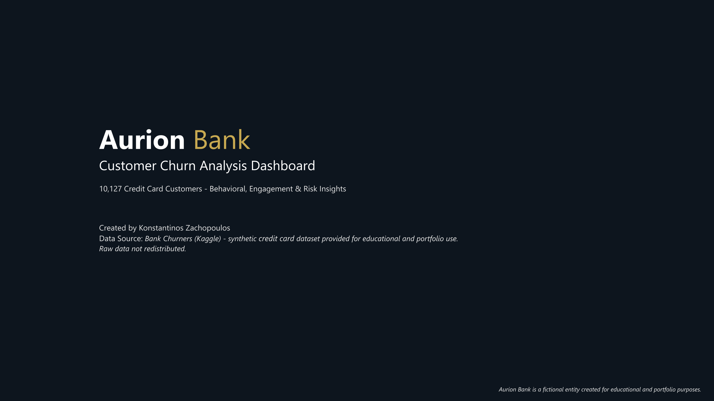

# 📊 Aurion Bank - Customer Churn Analysis (Power BI)

This project analyzes customer churn for **Aurion Bank** using a public Kaggle dataset (~10k customers).  
It explores customer profiles, behavioral patterns, engagement levels, churn drivers, and business recommendations.  
The dashboard is built in **Power BI**, using a clean data model, DAX measures, and visual storytelling.

## 🗂️ Project Structure

- PBIX file: Full Power BI report  
- PDF report: Printable version  
- PNG screenshots: Page-by-page visuals  
- README: Executive summary, insights & recommendations  

## 📁 Files

- [AurionBank_CustomerChurn.pbix](files/AurionBank_CustomerChurn.pbix)  
- [AurionBank_CustomerChurn_Report.pdf](files/AurionBank_CustomerChurn_Report.pdf)  

All dashboard images are stored in the `images` folder.

## 🧩 Executive Summary

### **Objective**  
Analyze churn behavior across credit card customers to identify risk patterns and retention opportunities.

### **Key Insights**
- Churn is moderate at **~16%** with clear pockets of elevated risk.  
- **Card tier matters:** Gold and Platinum churn more; Silver and Blue are more stable.  
- **Income follows a U-shaped pattern:** lowest churn in mid-income groups (60–80K).  
- **Utilization also shows a U-shape:** churn peaks at very low (0–10%) and very high (90–100%) utilization.  
- **Engagement is the strongest predictor:** inactivity and high contact frequency sharply increase churn.  
- **High spenders rarely churn**, while low-spending customers in extreme utilization bands show the highest risk.

### **Impact**  
These patterns support targeted retention actions, optimized product-tier strategy, and early detection of disengagement signals.

## 🖼️ Dashboard Preview

👉 [**View Full Dashboard (PDF)**](files/AurionBank_CustomerChurn_Report.pdf)
👉 [**Download Power BI File (PBIX)**](files/AurionBank_CustomerChurn.pbix)

## 🛠️ Tools & Techniques

- Power BI Desktop  
- Power Query (data cleaning)  
- DAX (churn metrics, KPIs, utilization metrics)  
- Data modeling (star schema)  
- Behavioral segmentation & customer profiling  
- Visual storytelling  

## 📚 Dataset Source

Public dataset from Kaggle:  
**“Bank Customer Churn Prediction”** (10,127 customers, anonymized)

## 💡 Key Recommendations

- **Re-activate low-use customers (0–10%):** targeted incentives; reminders after 1 month inactivity.  
- **Support high-utilization customers (90–100%):** credit-limit reviews; tailored repayment options.  
- **Reduce churn among high-contact customers:** route repeat callers to specialists; improve first-call resolution.  
- **Flag early disengagement:** monitor drops in spending/transactions and rising inactivity.  
- **Protect mid-utilization customers (40–70%):** maintain engagement via habit-building rewards.  
- **Personalize retention:** target stress-prone or value-driven segments.  
- **Focus on Blue tier:** largest segment; improvements here deliver the biggest overall impact.

## 🌐 Portfolio Site (Coming Soon)

This report will appear on my BI portfolio site:  
👉 https://kzanalytics.com

